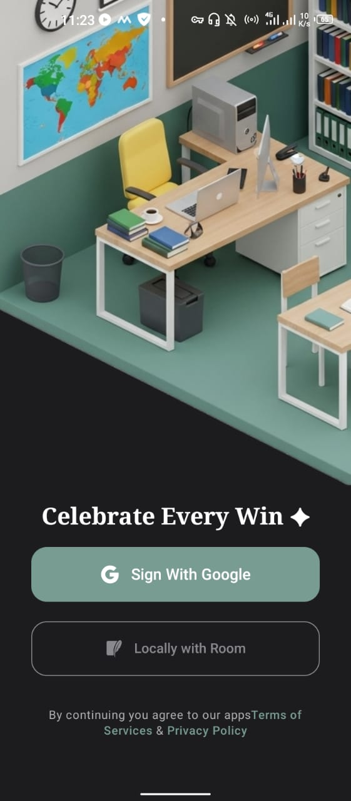
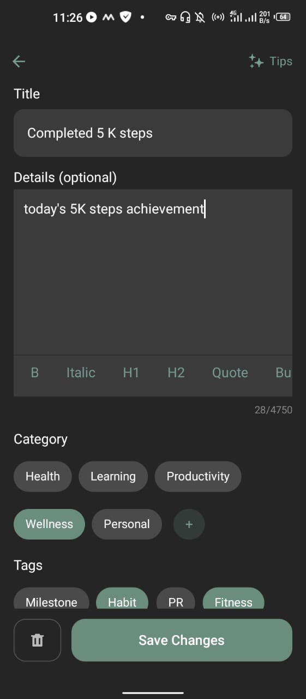
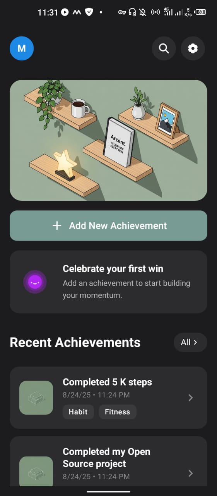

  

  A beautiful Android app for tracking and celebrating your personal achievements, no matter how small.

  

  
  
  

 
 

## ✨ What is Arcent?

Arcent helps you build positive momentum by documenting every victory in your life. Based on the psychological principle that celebrating small achievements builds self-confidence, the app encourages you to recognize every positive step on your journey.

Whether it's completing a workout, learning something new, finishing a project, or just having a good day - every win deserves celebration.

## 📸 Screenshots

  
  
  
  

## Arcent Features

### ✅ Available (DONE)
- **Beautiful Home Screen** - View your recent achievements at a glance
- **Rich Achievement Editor** - Add detailed descriptions with Markdown support and photos
- **Smart Organization** - Categories (Health, Learning, Productivity, Wellness, Personal) and custom tags
- **Powerful Search** - Find any achievement instantly across titles and details.
- **Different Storage Types** - Local storage or Cloud DB.
- **Photo Attachments** - Capture or add photos to document your wins

### 🚧 Coming Soon (Under Development)
- **Advanced Statistics** - Detailed analytics and progress tracking
- **Achievement Sharing** - Share your wins with friends
- **Smart Notifications** - Gentle reminders to celebrate your progress
- **Data Export** - Backup your achievements in multiple formats
- **AI Suggestions** - Smart recommendations for documenting wins

## Why Track Achievements?

- **Build Confidence** - See proof of your capabilities
- **Create Momentum** - Small wins lead to bigger victories
- **Develop Self-Awareness** - Understand your patterns of success
- **Stay Motivated** - Use past achievements as inspiration
- **Combat Negativity** - Focus on what's going right

## 🤝 Contributing

Want to help make Arcent even better? Check out our [Contributing Guide](./CONTRIBUTING.md).

## 📄 License

This project is licensed under the MIT License - see the [LICENSE](LICENSE) file for details.

---

  <em>Remember: Every win counts. Start celebrating yours today! ✦</em>

